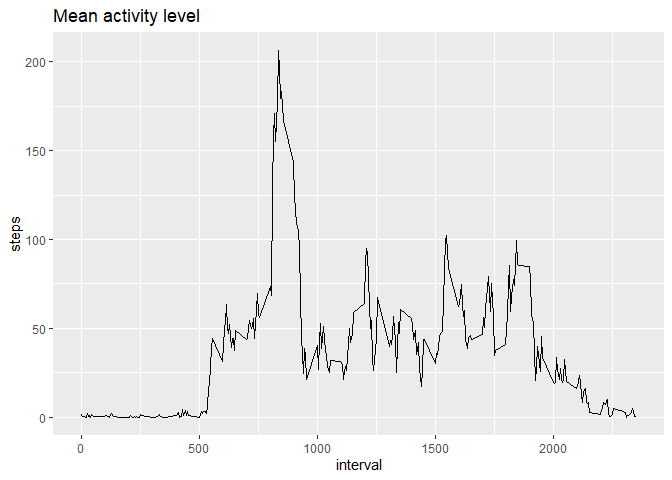

## Loading and preprocessing the data


```r
##Load packages
library(ggplot2)
library(dplyr)

#check if file is in directory
if (!file.exists('activity.csv')){
        unzip('activity.zip')
        }
#read csv file
data <- read.csv('activity.csv')
```

## What is mean total number of steps taken per day?

```r
# Histogram of total number of steps per day
plot1 <- ggplot(data, aes(date, steps))

plot1+geom_col()+ theme(axis.text.x = element_text(angle = 90)) + labs(title = "Number of steps taken each day")
```

```
## Warning: Removed 2304 rows containing missing values (position_stack).
```

<!-- -->

Calculate and report the **mean** and **median** total number of steps taken per day:


```r
# summarise number of steps per day

summary <- data %>% group_by(date) %>%
        summarise(total=sum(steps, na.rm = TRUE), 
                  mean= mean(steps, na.rm = TRUE), 
                  median = median(steps, na.rm = TRUE))
```

```
## `summarise()` ungrouping output (override with `.groups` argument)
```

```r
#mean and median of total steps per day

overall <- summary %>% summarise(total_mean=mean(total), total_median=median(total))

overall
```

```
## # A tibble: 1 x 2
##   total_mean total_median
##        <dbl>        <int>
## 1      9354.        10395
```

## What is the average daily activity pattern?

```r
#calculate average activity per 5 min interval

intervals <- data %>% mutate(intervalfactor = as.factor(interval)) %>% 
                        group_by(intervalfactor) %>%
                        summarise(meansteps = mean(steps, na.rm = TRUE)) %>%
                        mutate(interval = as.numeric(as.character(intervalfactor)))
```

```
## `summarise()` ungrouping output (override with `.groups` argument)
```

```r
#time series plot
plot2 <- ggplot(intervals, aes(x=interval, y=meansteps))

plot2 + geom_line() + labs(title = "Mean activity level", y="steps")
```

<!-- -->

Interval with maximum steps: 


```r
# 2. Which 5-minute interval, on average across all the days in the dataset, contains the maximum number of steps?

maxinterval <- intervals$interval[which.max(intervals$meansteps)]

maxinterval
```

```
## [1] 835
```


## Imputing missing values

The total number of missing values:


```r
# 1. Calculate and report the total number of missing values in the dataset (i.e. the total number of rows with `NA`s)

allnas <- sum(is.na(data))

allnas
```

```
## [1] 2304
```

Filling missing values with the mean of corresponding 5-min interval:


```r
#new dataset without missing values: narm_data

narm_data <- data

#create interval key

interval_key <- data$interval[(is.na(data$steps))]

#function that maps back interval to corresponding row in summary of intervals

indexfun <- function(x) {which(intervals$interval==x)}

#use function indexfun to fnd rows for the imputed means

mean_key <- sapply(interval_key, indexfun)

#exchange NAs for mean during interval

narm_data$steps[(is.na(data$steps))] <- intervals$meansteps[mean_key]
```

There are no missing values in new dataset:

```r
#check if na left

sum(is.na(narm_data))
```

```
## [1] 0
```

Histogram of total number of steps taken each day of new dataset:


```r
#Histogram of total steps per day

plot3 <- ggplot(narm_data, aes(date, steps))

plot3+geom_col()+theme(axis.text.x = element_text(angle = 90)) + labs(title= "Steps per day (after removing missing values)")
```

<!-- -->

Calculate and report the **mean** and **median** total number of steps taken per day:


```r
#calculate summary of steps taken per day
summary_rmna <- narm_data %>% group_by(date) %>%
        summarise(total=sum(steps, na.rm = TRUE), 
                  mean= mean(steps, na.rm = TRUE), 
                  median = median(steps, na.rm = TRUE))
```

```
## `summarise()` ungrouping output (override with `.groups` argument)
```

```r
#calculate mean and median of total number of steps per day

overall_rmna <- summary_rmna %>% summarise(mean_rmna=mean(total), median_rmna=median(total))

overall_rmna
```

```
## # A tibble: 1 x 2
##   mean_rmna median_rmna
##       <dbl>       <dbl>
## 1    10766.      10766.
```
Values before missing values were imputed:


```r
overall
```

```
## # A tibble: 1 x 2
##   total_mean total_median
##        <dbl>        <int>
## 1      9354.        10395
```

#### Do these values differ from the estimates from the first part of the assignment? What is the impact of imputing missing data on the estimates of the total daily number of steps?

The mean in the new dataset is not skewed anymore.Imputing missing values reduces the impact of outliers (i.e. day with very low activity) on summary statistics like mean. Since the median is less effected by outliers, it doesn't change too much after imputing.

## Are there differences in activity patterns between weekdays and weekends?


```r
# Create a new factor variable in the dataset with two levels -- "weekday" and "weekend" indicating whether a given date is a weekday or weekend day.

#add a column with weekdays

narm_data <- mutate(narm_data, weekdays = weekdays(as.Date(date)))

# add factor variables weekdays and calculate average steps taken per 5 min interval on weekdays
weekday <- narm_data %>% 
                filter(weekdays == "Monday"|weekdays == "Tuesday"|weekdays == "Wednesday"|weekdays == "Thursday"| weekdays == "Friday") %>%
                group_by(factor = as.factor(interval)) %>%
                summarise(mean = mean(steps)) %>%
                mutate(weekfactor = as.factor("weekday"), interval = as.numeric(as.character(factor)))
```

```
## `summarise()` ungrouping output (override with `.groups` argument)
```

```r
#add factor variable weekends and calculate average steps taken per 5 min interval on weekends

weekend <- narm_data %>% 
                filter(weekdays == "Saturday" | weekdays == "Sunday") %>%
                group_by(factor = as.factor(interval)) %>%
                summarise(mean = mean(steps)) %>%
                mutate(weekfactor = as.factor("weekend"), interval = as.numeric(as.character(factor)))
```

```
## `summarise()` ungrouping output (override with `.groups` argument)
```

```r
#combine datasets

narm_week <- rbind(weekday, weekend)

# panel plot of time series plots of the 5-minute interval (x-axis) and the average number of steps taken

plot4 <- ggplot(narm_week, aes(x=interval, y=mean))

plot4 + 
        geom_line() + 
        facet_grid(weekfactor ~ .) + 
        labs(title = "Mean activity level: Weekday vs Weekend", y= "steps")
```

<!-- -->


During weekdays people seem to be more active during a specific time interval (750-1000) whereas the activitylevel is more spread during the weekend.
